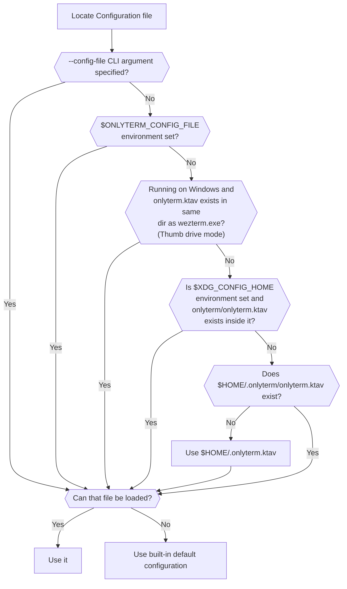

## Quick Start

Create a file named `.onlyterm.ktav` in your home directory, with the following
contents:

```
// For example, changing the initial geometry for new windows:
initial_cols: 120
initial_rows: 28

// or, changing the font size and color scheme.
font_size: 10.0
color_scheme: AdventureTime
```

!!! tip "Migrating from a `.wezterm.lua` or `.wezterm.rhai`?"

    WezTerm's config language changed from Lua, to rhai, and now to a static
    data format called [ktav](../migration-to-ktav.md). If you have an
    existing Lua or rhai config, see the
    [migration guide](../migration-to-ktav.md) for a side-by-side syntax
    translation. A leftover legacy `.rhai`/`.lua` file with no `.ktav`
    sibling will produce a clear error pointing you at it.

For more details, see:

- [initial_cols](reference/config/initial_cols.md)
- [initial_rows](reference/config/initial_rows.md)
- [font_size](reference/config/font_size.md)
- [color_scheme](reference/config/color_schemes.md)

## Configuration Files

`wezterm` will look for a `ktav` configuration file using the logic shown
below. (Earlier releases looked for a Lua `.wezterm.lua` file, then a rhai
`.wezterm.rhai`/`onlyterm.rhai` file; see the
[migration guide](../migration-to-ktav.md) to translate one.)

!!! tip
    The recommendation is to place your configuration file at `$HOME/.onlyterm.ktav`
    (`%USERPROFILE%/.onlyterm.ktav` on Windows) to get started.

More complex configurations can be placed in
`$XDG_CONFIG_HOME/onlyterm/onlyterm.ktav` (for X11/Wayland) or
`$HOME/.onlyterm/onlyterm.ktav` (for all other systems).





Prior to version 20210314-114017-04b7cedd, if the candidate file exists but
failed to parse, wezterm would treat it as though it didn't exist and continue
to try other candidate file locations. In all current versions of wezterm, an
error will be shown and the default configuration will be used instead.

!!! note
    On Windows, to support users that carry their wezterm application and
    configuration around on a thumb drive, wezterm will look for the config file in
    the same location as wezterm.exe.  That is shown in the chart above as thumb
    drive mode.  It is **not** recommended to store your configs in that
    location if you are not running off a thumb drive.

`wezterm` will watch the config file that it loads; if/when it changes, the
configuration will be automatically reloaded and the majority of options will
take effect immediately.  You may also use the `CTRL+SHIFT+R` keyboard shortcut
to force the configuration to be reloaded.

!!! info
    Since ktav is a static data format with no running engine, the config
    file is simply re-parsed from scratch each time it (re)loads; there is no
    concern about side effects from re-evaluating script code, unlike with
    the old Lua/rhai config formats.

### Configuration Overrides

{{since('20210314-114017-04b7cedd')}}

`wezterm` allows overriding configuration values via the command line; here are
a couple of examples:

```bash
$ wezterm --config enable_scroll_bar=true
$ wezterm --config 'exit_behavior="Hold"'
```

Configuration specified via the command line will always override the values
provided by the configuration file, even if the configuration file is reloaded.
Each `--config key=value` value is parsed as a standalone ktav value fragment
and spliced into the parsed config document, replacing that key.

Per-window configuration overrides set from inside your config file (the old
`window:set_config_overrides()` mechanism) no longer exist, since that
required a scripting callback with access to a live `window` object; there is
no ktav equivalent.

## Configuration File Structure

The `onlyterm.ktav` configuration file is a static ktav document: a flat or
nested set of `key: value` pairs, with no code to evaluate. A basic empty
(and rather useless!) configuration file is just an empty document.

A simple fragment like this:

```
color_scheme: Batman
```

sets `color_scheme`, and to also set the font in the same file you add
another top-level key:

```
font: { font: [{ family: "JetBrains Mono" }] }
color_scheme: Batman
```

(there is no `wezterm.font(...)` helper anymore — the `font` option is a
`TextStyle` object whose `font` field is an array of `FontAttributes`; see
the [migration guide](../migration-to-ktav.md)).

For the sake of brevity, individual snippets throughout the rest of these
docs may be shown as just a single key:

```
color_scheme: Batman
```

## Splitting your configuration across files

!!! note

    WezTerm's Lua config let you split a config across multiple files via
    Lua's `package.path` / `require`, and the rhai engine (briefly) supported
    packaging shared code as a plugin. Neither mechanism exists for ktav:
    there is no `import`, no `require`, and no plugin loading, since all of
    those required a scripting engine to evaluate the imported code. A ktav
    config is a single `onlyterm.ktav` file; if you need different configs in
    different contexts, maintain separate files and select between them via
    `--config-file`/`ONLYTERM_CONFIG_FILE`.

## Configuration Reference

Continue browsing this section of the docs for an overview of the commonly
adjusted settings, or visit the [config reference](reference/config/index.md) for a
more detailed list of possibilities.
