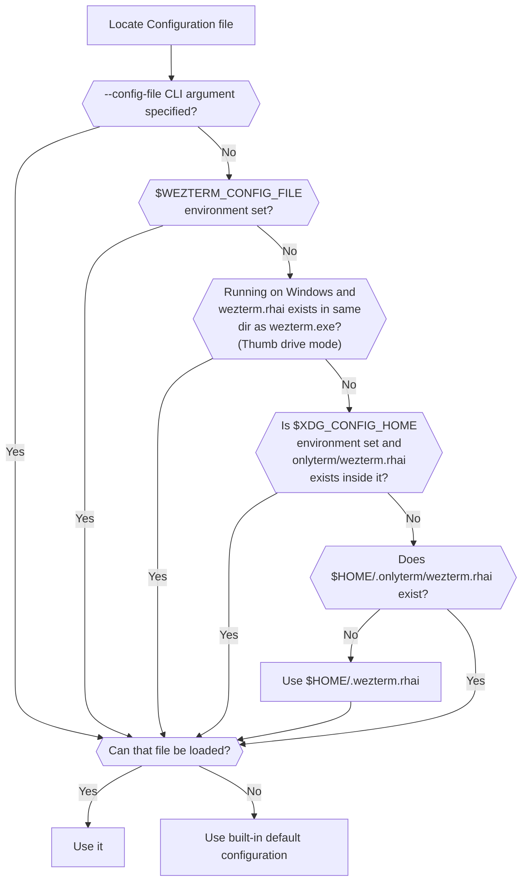

## Quick Start

Create a file named `.wezterm.rhai` in your home directory, with the following
contents:

```rhai
// The whole script evaluates to a config object-map.
// There is no `require` and no `config_builder()`: every option is just
// a key in the map returned as the last expression.
#{
    // For example, changing the initial geometry for new windows:
    initial_cols: 120,
    initial_rows: 28,

    // or, changing the font size and color scheme.
    font_size: 10.0,
    color_scheme: "AdventureTime",
}
```

!!! tip "Migrating from a `.wezterm.lua`?"

    WezTerm's config language changed from Lua to [rhai](https://rhai.rs/).
    If you have an existing Lua config, see the
    [Lua → rhai migration guide](../migration-lua-to-rhai.md) for a
    side-by-side syntax translation. A leftover `.wezterm.lua` with no
    `.wezterm.rhai` sibling will produce a clear error pointing you at it.

For more details, see:

- [initial_cols](reference/config/initial_cols.md)
- [initial_rows](reference/config/initial_rows.md)
- [font_size](reference/config/font_size.md)
- [color_scheme](reference/config/color_schemes.md)

## Configuration Files

`wezterm` will look for a [rhai](https://rhai.rs/) configuration file using the
logic shown below. (Earlier releases looked for a Lua `.wezterm.lua` file; see
the [migration guide](../migration-lua-to-rhai.md) to translate one.)

!!! tip
    The recommendation is to place your configuration file at `$HOME/.wezterm.rhai`
    (`%USERPROFILE%/.wezterm.rhai` on Windows) to get started.

More complex configurations can be placed in
`$XDG_CONFIG_HOME/onlyterm/wezterm.rhai` (for X11/Wayland) or
`$HOME/.onlyterm/wezterm.rhai` (for all other systems).





Prior to version 20210314-114017-04b7cedd, if the candidate file exists but
failed to parse, wezterm would treat it as though it didn't exist and continue
to try other candidate file locations. In all current versions of wezterm, an
error will be shown and the default configuration will be used instead.

!!! note
    On Windows, to support users that carry their wezterm application and
    configuration around on a thumb drive, wezterm will look for the config file in
    the same location as wezterm.exe.  That is shown in the chart above as thumb
    drive mode.  It is **not** recommended to store your configs in that
    location if you are not running off a thumb drive.

`wezterm` will watch the config file that it loads; if/when it changes, the
configuration will be automatically reloaded and the majority of options will
take effect immediately.  You may also use the `CTRL+SHIFT+R` keyboard shortcut
to force the configuration to be reloaded.

!!! info
    **The configuration file may be evaluated multiple times for each wezterm
    process** both at startup and in response to the configuration file being
    reloaded.  You should avoid taking actions in the main flow of the config file
    that have side effects; for example, unconditionally launching background
    processes can result in many of them being spawned over time if you launch
    many copies of wezterm, or are frequently reloading your config file.

### Configuration Overrides

{{since('20210314-114017-04b7cedd')}}

`wezterm` allows overriding configuration values via the command line; here are
a couple of examples:

```bash
$ wezterm --config enable_scroll_bar=true
$ wezterm --config 'exit_behavior="Hold"'
```

Configuration specified via the command line will always override the values
provided by the configuration file, even if the configuration file is reloaded.

Each window can have an additional set of window-specific overrides applied to
it by code in your configuration file.  That's useful for eg: setting
transparency or any other arbitrary option on a per-window basis.  Read the
[window:set_config_overrides](reference/window/set_config_overrides.md) documentation
for more information and examples of how to use that functionality.

## Configuration File Structure

The `.wezterm.rhai` configuration file is a rhai script which allows for a high
degree of flexibility. The script is expected to evaluate to a configuration
object-map, so a basic empty (and rather useless!) configuration file will look
like this:

```rhai
#{}
```

Throughout these docs many configuration fragments are still shown in Lua syntax
(they predate the rhai switch); the [migration guide](../migration-lua-to-rhai.md)
explains how to read them as rhai. A simple fragment like this:

```rhai
#{
    color_scheme: "Batman",
}
```

sets `color_scheme`, and to also set the font in the same file you merge the keys
into one map:

```rhai
#{
    font: #{ font: [#{ family: "JetBrains Mono" }] },
    color_scheme: "Batman",
}
```

(`wezterm.font(...)` has no rhai helper — the `font` option is a `TextStyle`
object whose `font` field is an array of `FontAttributes`; see the migration
guide.)

For the sake of brevity, individual snippets may be shown as just a single key:

```rhai
color_scheme: "Batman",
```

## Splitting your configuration across files

!!! note

    WezTerm's Lua config let you split a config across multiple files via Lua's
    `package.path` / `require`. **The rhai engine does not yet wire up rhai's
    `import`/module resolution**, so a rhai config is currently a single
    `.wezterm.rhai` file. To share code, package it as a
    [plugin](plugins.md) (a directory with a `plugin/init.rhai` entry point,
    loaded via `plugin::require("path")`). The legacy `package.path`-based
    Lua module layout below no longer applies to the rhai engine.


## Configuration Reference

Continue browsing this section of the docs for an overview of the commonly
adjusted settings, or visit the [config reference](reference/config/index.md) for a
more detailed list of possibilities (the per-option reference pages still show
Lua examples; use the [migration guide](../migration-lua-to-rhai.md) to read
them as rhai).
